#  Lab 8 — Web Service PHP & Application Android (Volley + Gson)

### Architecture complète : **MySQL + PHP (MVC) + Android (Volley + Gson)**

---

#  Partie 1 — Création de la base de données MySQL

##  Création de la base de données

```sql
CREATE DATABASE school1;
```

---

##  Création de la table `Etudiant`

```sql
CREATE TABLE Etudiant (
  id INT AUTO_INCREMENT PRIMARY KEY,
  nom VARCHAR(50),
  prenom VARCHAR(50),
  ville VARCHAR(50),
  sexe VARCHAR(10)
);
```
<p align="center"> 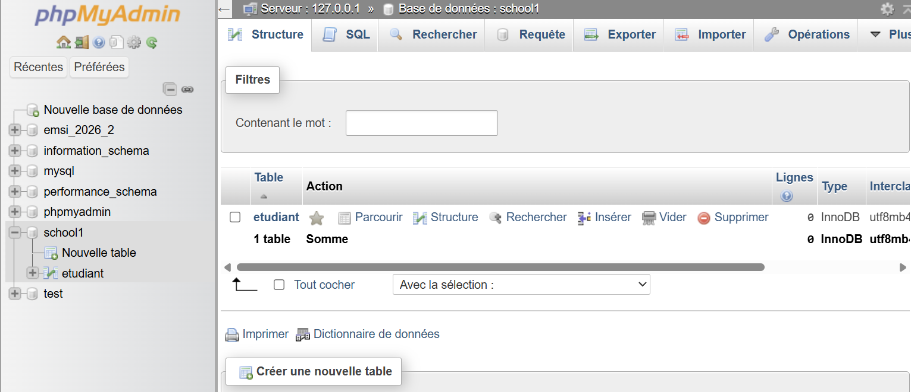 </p>

---

##  Insertion de données tests

<p align="center"> 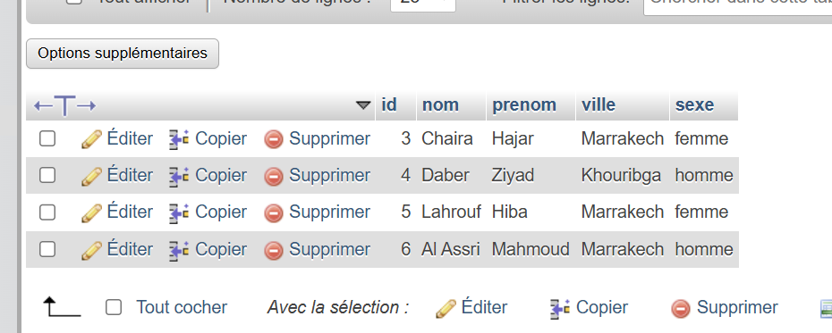 </p>

-La base est prête pour le Web Service.

---

#  Partie 2 — Développement du Web Service PHP

## Structure du projet (VS Code)

<p align="center"> 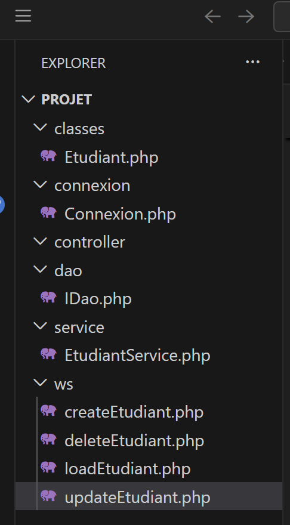 </p>

## Architecture utilisée (MVC simplifiée)

- **Model** → `Etudiant.php`
- **DAO** → `IDao.php`
- **Service** → `EtudiantService.php`
- **Connexion PDO** → `Connexion.php`
- **API Endpoints** → Dossier `ws`

---

##  Endpoints API

| Méthode | URL | Description |
|----------|------|------------|
| GET | /ws/loadEtudiant.php | Charger tous les étudiants |
| POST | /ws/createEtudiant.php | Ajouter |
| POST | /ws/deleteEtudiant.php | Supprimer |
| POST | /ws/updateEtudiant.php | Modifier |

---

##  Tests avec Postman

###  Ajouter un étudiant

POST  
```
http://localhost/projet/ws/createEtudiant.php
```

Body → x-www-form-urlencoded :

```
nom = Chaira
prenom = Ayoub
ville = Marrakech
sexe = homme
```
<p align="center"> 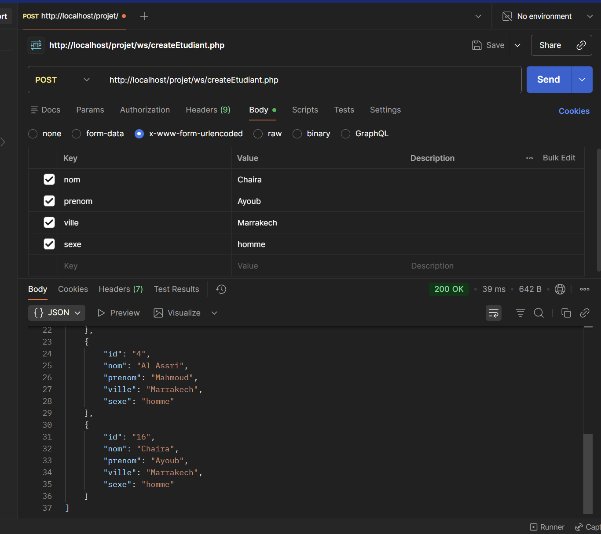 </p>


###  Charger la liste

GET :

```
http://localhost/projet/ws/loadEtudiant.php
```
<p align="center"> 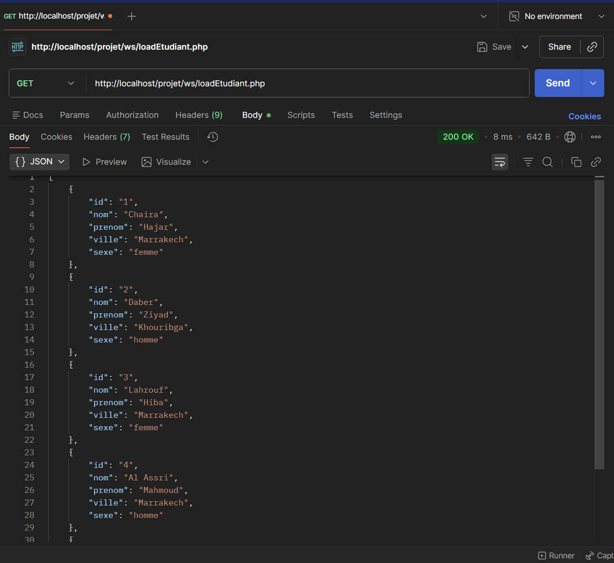 </p>
Retour :

```json
[
  {
    "id": "1",
    "nom": "Chaira",
    "prenom": "Hajar",
    "ville": "Marrakech",
    "sexe": "femme"
  }
......
]
```

 Les tests Postman confirment le bon fonctionnement du backend.

---

#  Partie 3 — Application Android (Java + Volley + Gson)

## Test et vérification:
<p align="center"> 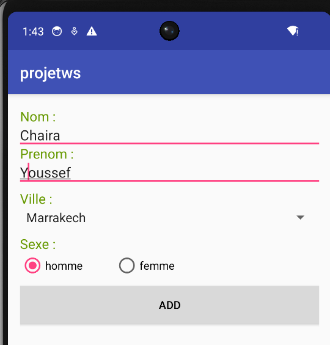 </p>
<p align="center"> 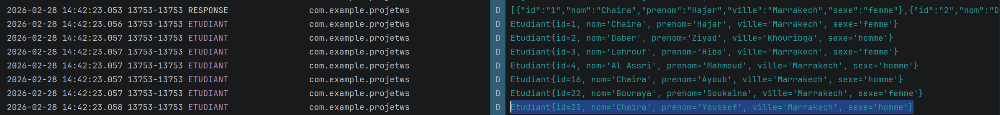 </p>
---

##  Fonctionnalités implémentées

###  1. Ajouter un étudiant

- Formulaire (Nom, Prénom, Ville, Sexe)
<p align="center"> 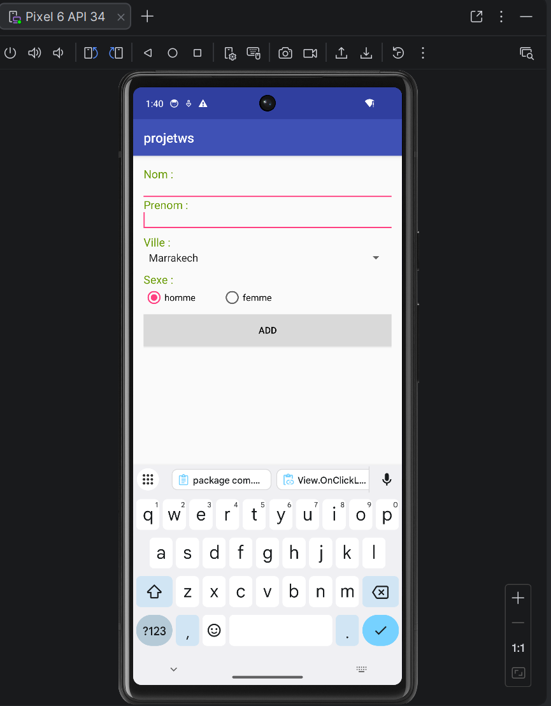 </p>
---

###  2. Affichage de la liste

- RecyclerView
- Adapter personnalisé
- Chargement via GET
- Actualisation dynamique
<p align="center"> 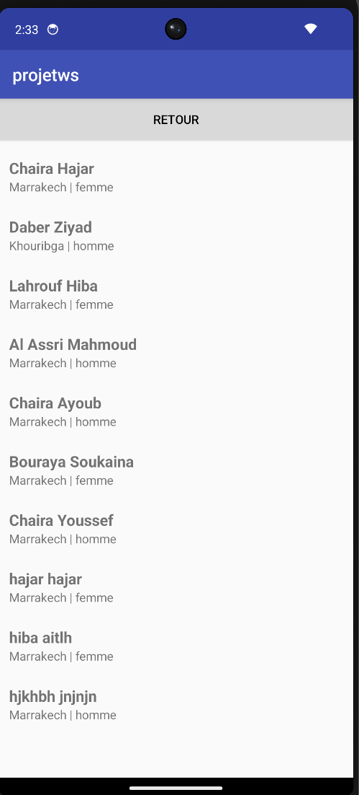 </p>

---
###  3. Suppression

- Popup confirmation
- Suppression via POST
- Mise à jour immédiate
- Toast de confirmation
<p align="center"> 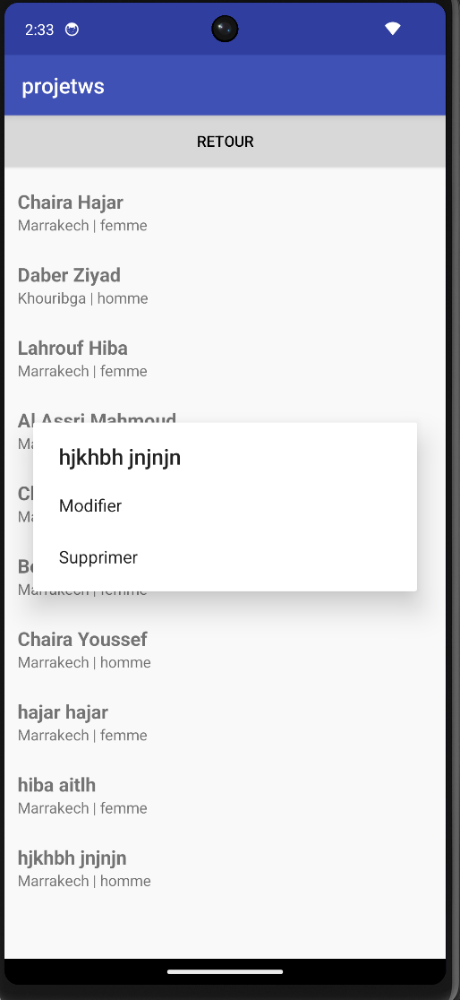 </p>
<p align="center"> 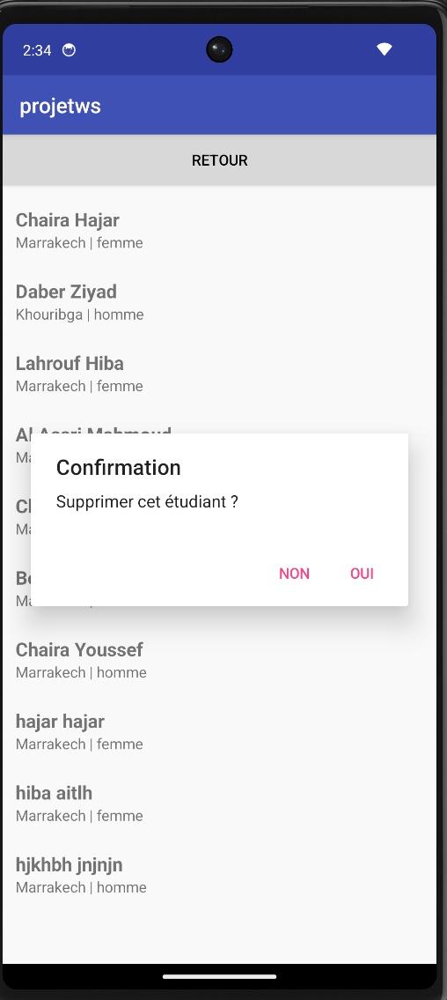 </p>
<p align="center"> 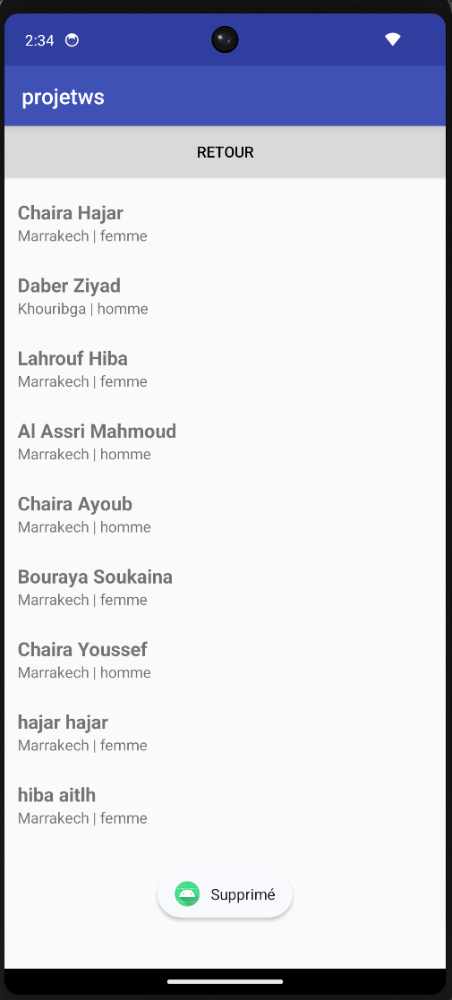 </p>
---
###  3. Modification

- Clic sur un étudiant
- Popup avec options
- Formulaire de modification
- Mise à jour via POST
- Refresh automatique
<p align="center"> 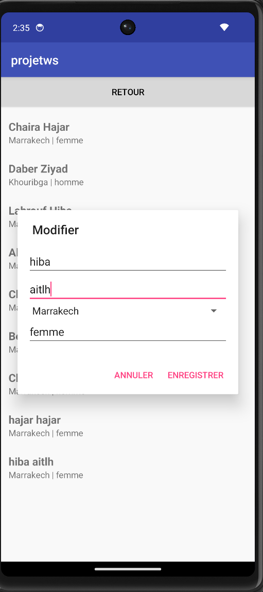 </p>
<p align="center"> 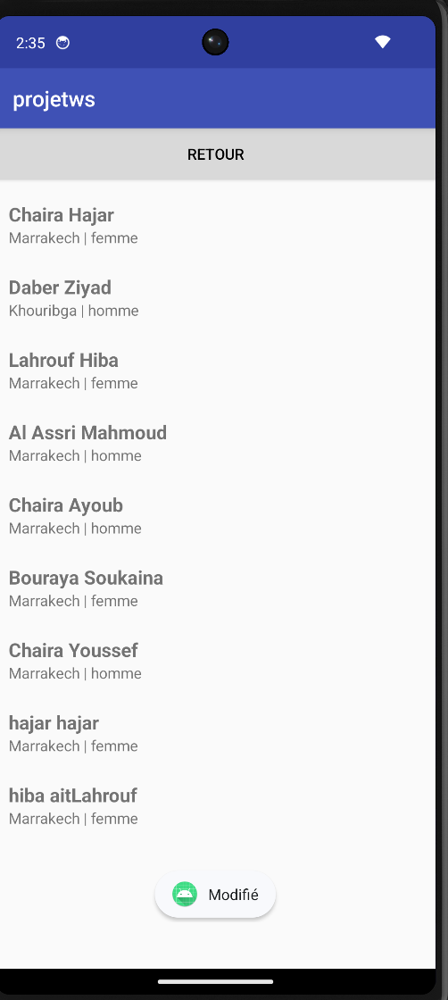 </p>
---

---

#  Challenge final réalisé

1.  Activité affichant la liste complète  
2.  Popup Modifier / Supprimer  
3.  Confirmation avant suppression  
4.  Actualisation dynamique  
5.  Bouton retour vers AddEtudiant  
6.  Gestion propre des réponses JSON  

---

#  Fonctionnement global

```
Android App
      ↓ (HTTP - Volley)
Web Service PHP
      ↓ (PDO)
Base MySQL
```

---


